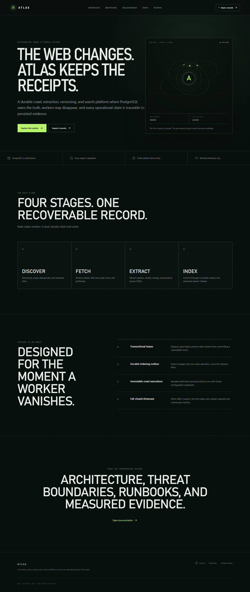
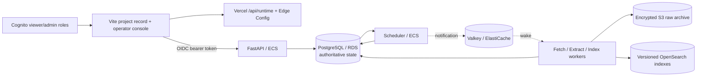

# Atlas

Atlas is a durable, policy-aware web crawl, extraction, versioning, and search platform. It is built to answer a harder question than “can a worker download pages?”: **can a crawl remain correct when queues lose notifications, workers disappear, search is unavailable, and the same URL changes over time?**

The permanent project record is deployed at [atlas-rho-brown.vercel.app](https://atlas-rho-brown.vercel.app), and the source is public at [YuvrajKashyap/atlas](https://github.com/YuvrajKashyap/atlas). `atlas.yuvrajkashyap.com` is attached to the Vercel project and awaits its Porkbun CNAME.



## System contract

- PostgreSQL is the source of truth for runs, frontier state, stage tasks, leases, observations, versions, incidents, and historical metrics.
- Redis/RQ transports notifications. Losing Redis cannot lose work.
- Fetch, extract, and index are separate idempotent stages with opaque lease tokens, heartbeats, bounded retries, and dead-letter state.
- OpenSearch writes flow through a durable outbox; an index outage does not repeat a network fetch.
- Raw HTML is encrypted in object storage and can be reprocessed with a new parser without touching the source site.
- Public fetches enforce allowlists, robots policy, DNS-pinned public addresses, redirect revalidation, ports, content types, byte limits, concurrency, politeness, depth, duration, and page budgets.
- The Vercel site is permanent. The AWS runtime is expiring and on demand. Missing or invalid runtime state fails closed.
- Dashboard data comes from persisted records or checked-in benchmark artifacts. Atlas does not render generated telemetry.

## Architecture



The repository deliberately keeps one Python package while deploying distinct API, scheduler, and worker processes. That preserves transactional boundaries without creating network boundaries that do not yet buy the system anything.

## Product surfaces

The public Vercel layer contains the product overview, architecture, verified benchmark page, documentation, demo status, source status, and runtime status. The authenticated `/console` contains:

- Command Center and real time-series telemetry
- Crawl definitions, schedules, and immutable runs
- Frontier and stage-task inspection
- Document Explorer, version history, duplicate clusters, and parser preview
- Corpus search with filters, facets, highlights, cursors, and index-version metadata
- Domain health, workers, dead letters, incidents, and index builds

## Local development

Requirements: Docker Desktop, Python 3.13, [uv](https://docs.astral.sh/uv/), Node.js 24, and pnpm 10.

```powershell
Copy-Item .env.example .env
docker compose up --build
```

- Vite console: <http://localhost:4173>
- FastAPI: <http://localhost:8000>
- OpenAPI: <http://localhost:8000/docs>
- OpenSearch: <https://localhost:9200>

Focused host-side checks:

```powershell
cd backend
uv sync --locked --all-groups
uv run alembic upgrade head
uv run ruff check .
uv run pyright
uv run pytest --cov=atlas

cd ..\web
pnpm install --frozen-lockfile
pnpm lint
pnpm build
pnpm test
pnpm test:e2e
```

## On-demand AWS demonstration

The protected **launch Atlas runtime** GitHub workflow requires an explicit expiration and an Infracost ceiling before creating resources. It then builds an immutable ECR image, applies either the `showcase` or `production` Terraform profile, verifies Cognito enforcement, completes a controlled crawl, and publishes `online` to Edge Config.

The protected **destroy Atlas runtime** workflow stops new work, drains leases, exports real run evidence, publishes `offline`, destroys Terraform resources, deletes the versioned state bucket, and fails if active Atlas-tagged resources remain. A scheduled workflow dispatches teardown when the public lease expires.

No AWS apply has been run from this checkout because AWS credentials are not configured. Infrastructure code is validated, but a release is not complete until the live recovery and cleanup gates pass.

## Engineering record

- [Architecture](docs/architecture.md)
- [Threat model](docs/threat-model.md)
- [Infrastructure security exceptions](docs/security-exceptions.md)
- [Service-level objectives](docs/slos.md)
- [Benchmark methodology](docs/benchmark.md)
- [Release checklist](docs/release-checklist.md)
- [Launch runbook](docs/runbooks/launch.md)
- [Teardown runbook](docs/runbooks/teardown.md)
- [Incident and recovery runbook](docs/runbooks/incident-recovery.md)
- [Architecture decisions](docs/adr/)

## Current release status

The permanent Vercel site and Edge Config contract are live and verified in the intentional `offline` state. The public GitHub repository is online with green CI, container scanning, SBOM generation, and CodeQL analysis for Python and TypeScript. The backend has 69 passing tests, 91.03% overall coverage, and at least 90% coverage in every critical pipeline module. Terraform validates and Checkov reports zero failures. The remaining hard gates are tracked openly: the deterministic 10,000-page recovery benchmark has not yet produced a publishable artifact, an authenticated live-console journey and AWS recovery/teardown have not run, and the signed release and demo recording are pending that verified release.
