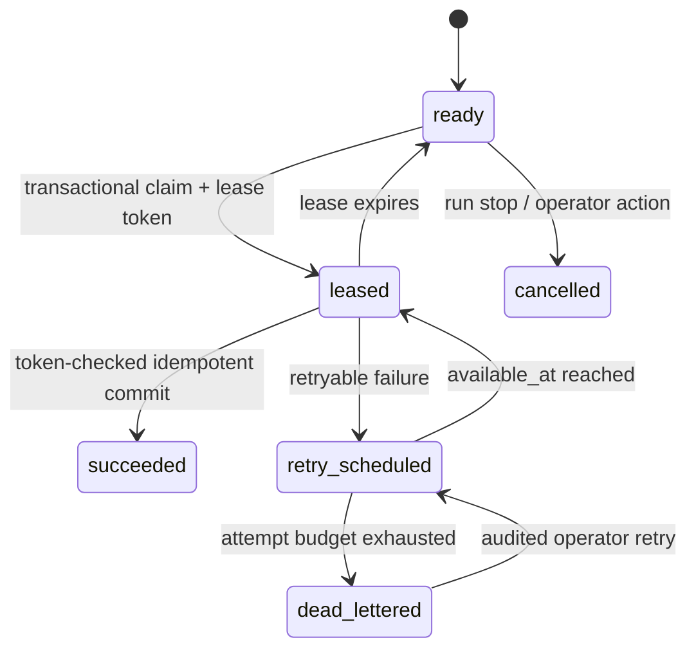

# Architecture

## Boundaries

Atlas has a permanent presentation/control client and an expiring execution plane.

1. Vercel serves the Vite project record and `/api/runtime` function continuously.
2. Edge Config carries only the public runtime lease: state, API URL, environment ID, last verification, expiration, and a short message.
3. The browser enables the console only after that record says `online` **and** a direct `/health` probe identifies `atlas-api`.
4. Cognito configuration is discovered from the healthy API. Authorization remains enforced by FastAPI; browser state is never authoritative.
5. AWS contains the control API, scheduler, workers, state, queue transport, encrypted blobs, and search.

## Durable task state machine

Each frontier entry advances through persisted `fetch`, `extract`, and `index` tasks.

Redis receives an RQ notification only after the database task exists. The scheduler continuously scans eligible PostgreSQL rows using lock-safe claims, so notification loss is repairable. Duplicate delivery is harmless because stage transitions require the current lease token and completed stages have unique idempotency constraints.

## Fetch safety

The URL policy normalizes and validates scheme, user info, host, port, and allowlist membership. DNS answers are resolved once, rejected if any selected address is non-public, and pinned into the HTTP connector while the original hostname remains available for TLS SNI and certificate validation. Every redirect re-enters the same policy. The response is streamed with a hard byte ceiling and accepted only for configured HTML media types. Robots policy is fetched through the same network boundary.

## Corpus identity

`WebResource` is the stable identity of a normalized URL within a crawl definition. A crawl execution creates an observation. A changed successful observation may create a `Document` version linked to its predecessor. Exact hashes detect identical content; SimHash bands find near-duplicate candidates; change classification distinguishes unchanged, metadata-only, minor, and substantial changes. Canonical URLs are aliases, not replacements for the fetched resource identity.

## Search consistency

Extraction commits an `IndexOperation` in the same database transaction as the document version. The index worker writes the stable document ID to the configured physical index and then marks the outbox row successful. Rebuilds create a new versioned physical index, reindex authoritative current documents, verify expected counts, and atomically switch read/write aliases.

## Deployment profiles

| Concern | Showcase | Production |
|---|---|---|
| Application networking | Public-IP Fargate tasks with zero inbound rules; avoids NAT idle cost | Private application subnets with NAT per AZ |
| API | One Fargate task behind ALB and CloudFront TLS | Two or more tasks with circuit-breaker rollback |
| PostgreSQL | Single-AZ `db.t4g.micro`, encrypted, short backups | Multi-AZ `db.r7g.large`, 30-day backups, Performance Insights |
| Valkey | One encrypted node, notification-only | Multi-AZ primary/replica |
| OpenSearch | One small VPC node and 10 GiB | Two AZ-aware nodes and 100 GiB |
| Workers | One, capped at four | Starts at two, configurable ceiling |
| Logs | Seven days | Ninety days |

CloudFront supplies the temporary HTTPS API URL. The public ALB accepts origin traffic only from AWS’s managed CloudFront origin-facing prefix list.
